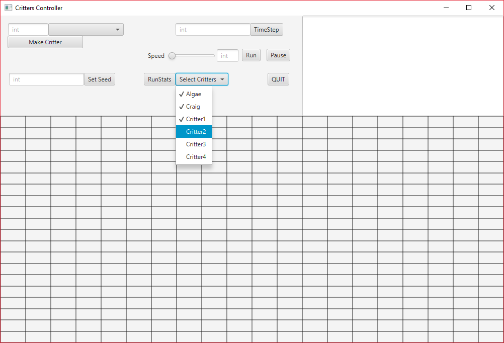

# EE422C_Project5
Project 5.

[Github URL](https://github.com/hamzacooly/EE422C_Project5)

## Hamza Khatri

**eid:** hak533

**Unique:** 16220

**Slip days used:** <0>

## Ali Kedwaii

**eid:** mak3799

**Unique:** 16238

**Slip days used:** <0>

### Description

Our code is largely unchanged aside from updating our individual `Critter` classes, adding a `Controller` class to handle all the `EventHandlers` for the UI, and updating `displayWorld()` to include a `getShape()` method, which returns a `Canvas` object to be used in the display.

We have an `AnchorPane` for the controller and a `TextArea` for the `RunStats` display, both of which are in an `HBox`. The `HBox` and the `GridPane` that represents the world are both in a `VBox`.

For the controller, we have a `Button` and `TextField` for `SetSeed`, a `Button`, `TextField`, and `ChoiceBox` for `MakeCritter`, a `Button` and `TextField` for `TimeStep`, a `Slider`, `TextField` and two `Buttons` for animation, a `Button` and a `MenuButton` with `CheckMenuItem` nodes for `RunStats`, and a `Button` for `quit`.

The `runStats` `MenuButton` contains `CheckMenuItem` nodes to allow selection for multiple `Critters`. Upon clicking `RunStats`, the information will be printed into the `TextArea` on the top right.

We have both a `Slider` and a `TextField` to control the animation. So, you can either type into the `TextField` or slide the `Slider`, and the other will be updated to match. These are used to change the speed of the animation. Upon hitting `Run`, all other `Buttons` are disabled except for `Pause` and `Quit`. Pressing `Pause` re-enables the other `Buttons`.